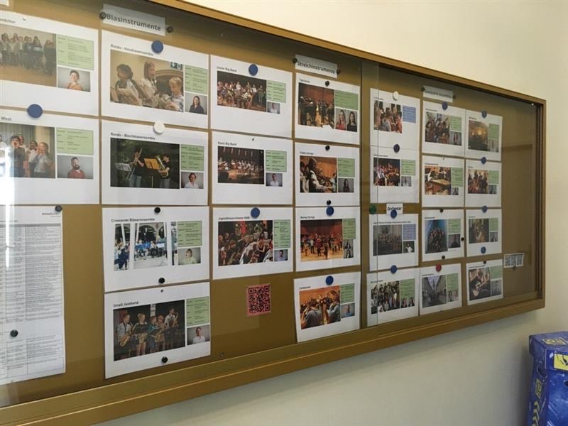

+++
title = "NO PAIN, NO GAIN!"
date = "2023-05-15"
draft = false
pinned = false
tags = ["Deutsch", "Reportage", "Musik"]
image = "img_0208.jpeg"
description = "Immer mehr Schülerinnen und Schüler des Konservatoriums Bern nehmen an einem Förderprogramm teil, investieren mehr Zeit in ihr Hobby, setzen sich vermehrt mit der Musik auseinander. Wie entwickelt sich ihr Weg? Was müssen die Jugendliche alles leisten, um an ihre Ziele zu gelangen?"
+++


Immer mehr Schülerinnen und Schüler des Konservatoriums Bern nehmen an einem Förderprogramm teil, investieren mehr Zeit in ihr Hobby, setzen sich vermehrt mit der Musik auseinander. Wie entwickelt sich ihr Weg? Was müssen die Jugendliche alles leisten, um an ihre Ziele zu gelangen?



*Autorinnen: Lia Hess, Clara Lauber und Helena Trautmann (M25a)*

Es ist ein regnerischer Montagmorgen, kurz nach acht. Normalerweise sitzt der 16-jährige Gymnasiast Aaron Wulf zu dieser Uhrzeit im Konservatorium Bern und übt Percussion. Percussion ist ein Oberbegriff für den Bereich der Schlag- und Effektivinstrumente; jedes Perkussionsinstrument hat dabei eine individuelle Herkunft bzw. eine kulturelle Bedeutung. Dieses Mal jedoch ist er für das Interview mit uns in die Mediothek des Gymnasium Kirchenfelds gekommen. Die rechteckige Brille auf der Nase, die blonden Locken zu einem Dutt zusammengebunden und die Kopfhörer um den Nacken gelegt, sehen wir ihn an einem der Tische. Auf den ersten Blick ist nicht erkennbar, was sein Hobby ist, und noch weniger, was es für ihn bedeutet - was uns jedoch schon sehr bald klar wird. Seit zehn Jahren spiele er Percussion, ausserdem habe er sechs Jahre lang Klavier gespielt, wegen der Schule dann jedoch aufgehört, erzählt er uns. Nebenbei sei er in einem Fussballverein.

Er ist nicht der Einzige, der einen Teil seiner Freizeit mit Üben und der Teilnahme an Ensembles, also einer Gruppe von Musikern, und anderen solchen Aktivitäten verbringt. Die Stücke sind schwer und erfordern viel Übungszeit; täglich setzt man sich für mehrere Stunden hin und wiederholt schwierige Stellen, erlernt neue Techniken, feilt an der musikalischen Interpretation, bis sie nach mehreren Wochen bis gar Monaten endlich konzertreif sind und bei einer Musizierstunde, einem Talentförderungskonzert oder einem Wettbewerb vorgespielt werden können. Es braucht Ausdauer, so lange am selben Stück zu arbeiten, doch umso grösser ist die Lust, die Stücke in den Griff zu bekommen, um sie eines Tages einem Publikum präsentieren zu können. „Das Durchhalten ist nicht immer so einfach. Man kommt jedoch auch nicht weiter, wenn man nichts macht“, findet er. So ergeht es vielen Jugendlichen, die sich für ein Leistungshobby entschieden haben. Es kostet Zeit, Nerven und Geld, doch die Freude an der Musik und der Spass am Instrument motiviert sie und zeigt ihnen, was das Schöne an ihrem Hobby ist. Zudem können die Jugendlichen eine sogenannte Talentcard beantragen, mit der ihnen Stipendien und Dispensationen vom Schulunterricht ermöglicht werden.



#### Talentcard

Jede/r, der sich für Musik interessiert und mehr Zeit dafür investieren möchte, jedoch findet, dass es unter den gegebenen Umständen nicht möglich ist, kann eine Talentcard auf bernertalent.ch beantragen. Dadurch kann ihm/ihr mehr Übungs- und Unterrichtszeit ermöglicht werden, man wird möglicherweise finanziell entlastet und auch bieten sich mehr Möglichkeiten, die Leidenschaft auszuüben.



Nicht nur in der Musik braucht es viel Durchhaltevermögen - auch im Leistungssport und allen anderen Bereichen, in welchen ein grosser Erfolg erzielt werden soll, wird Beharrlichkeit und Kontinuität gebraucht. Dazu passt auch eine Aussage über Kobe Bryant, ein kürzlich verunfallte Basketballspieler der National Basketball League, kurz NBL, von seinem Trainer, Phil Jackson: „Er erreichte sein Ziel durch Einsatz und Beharrlichkeit“.

> «Es kostet Zeit, Nerven und Geld, doch die Freude an der Musik und der Spass am Instrument motiviert sie und zeigt ihnen, was das Schöne an ihrem Hobby ist.» 

## Das Ziel - der Erfolg

Viele Jugendliche, welche sich intensiv mit Musik auseinandersetzen, fangen bereits im Kindesalter damit an. Beim Erlernen eines Instrumentes bilden sich im Gehirn Vernetzungen, was bei Kindern deutlich schneller und einfacher zustande kommt als bei Erwachsenen. Ab einem gewissen Alter stellen sich dann die Fragen: Wie viel möchte ich noch für die Musik investieren? Was sind meine Prioritäten? Wo sind meine Grenzen? Vor allem Jugendliche versuchen oft, ihren persönlichen Interessen nachzugehen und einen Mittelweg zu finden, auf dem sie alles vereinigen können, was ihnen wichtig ist. Dafür müssen viele Entscheidungen getroffen werden, welche sehr gut überlegt sein müssen, denn diese Entscheidungen können die gesamte Zukunft der Jugendlichen entsprechend bestimmen. Auch muss den Jugendlichen klar sein, worauf sie hinarbeiten, was ihre Ziele sind. Diese sind sehr individuell und auch von unterschiedlicher Bedeutung, sowohl für den/die Jugendliche/n, als auch für andere Betroffene, wie zum Beispiel den/die Lehrer/in; entscheidend ist aber, dass es die kleinen und grossen Erfolge prägt. Ob es nun darum geht, ins Ensemble zu kommen oder das momentane Stück bei der nächsten Musizierstunde vorspielen zu können, bei all dem geht es darum, weiterzukommen, sich zu verbessern und seine Leidenschaft auszuüben. Als Schüler mit dem Schwerpunktfach Biologie und Chemie tendiert Aaron eher dazu, Naturwissenschaften zu studieren; er möchte die Musik jedoch keinesfalls aufgeben. Er bestätigt: „Ich mag die Theorie nicht so wahnsinnig, sondern spiele einfach sehr gerne.“ Ihm ist wichtig, dass er neben der Musik noch Zeit für die Schule und andere Hobbys hat, meint jedoch, mit einer guten Organisation sei das kein Problem. Auch andere Jugendliche finden, dass sie trotz der vielen Übungszeit noch genügend Freizeit haben, die sie mit ihren Freunden verbringen können. Durch den vielen Kontakt mit anderen Jugendlichen, welche die gleiche Leidenschaft teilen, wird ihnen zudem ein weiterer Weg zur Verfügung gestellt, wie sie gute Freunde finden können.

> «Was werde ich letztendlich machen? Kann ich meine Ziele erreichen? Was wird aus mir? All das sind Fragen, welche sich die Jugendlichen in Bezug auf ihre Zukunft stellen. « - M. Grochowina 

## Die Zukunft

Es braucht vieles, um professionelle/r Musiker/in zu werden. Um mehr dazu zu erfahren, begeben wir uns ins Konservatorium Bern, mitten in der Altstadt. Am Montagmorgen um 11 Uhr ist es noch ruhig, die Cafeteria leer. Der Unterricht hat für die meisten noch nicht begonnen. Uns empfängt Marcin Grochowina, professioneller Musiker und Leiter verschiedener Fachbereiche des Konservatorium Berns, unter anderem der Förderprogramme. Wir betreten sein Zimmer. Es ist eher klein und wirkt wie eine Mischung aus einem gewöhnlichen Büro, mit Schreibtisch, Topfpflanze und Bildern an den Wänden, und einem Musikzimmer, da in der Ecke ein Klavier platziert wurde. Während unseres Gesprächs betont er: „Das Wichtigste ist die eigene Überzeugung und das Wollen.“ Später fügt er hinzu, dass aber auch das Talent und Können von wichtiger Bedeutung seien. Die berufliche Entscheidung für diesen Bereich fälle man heutzutage meistens im Alter von 16 bis 18 Jahren, also einem Alter, in welchem man sich auch oft die Fragen stelle: Wie sieht der Alltag später aus? Was werde ich letztendlich machen? Kann ich meine Ziele erreichen? Was wird aus mir? Musik sei zwar ein sehr schöner Bereich, welcher jedoch gleichzeitig viele unklare Felder und Fragezeichen aufweise. Man wisse nicht, was auf einen zukomme, wohin es einen treibe. Ausserdem habe man als Musiker/in viel Konkurrenz und sei oft allein unterwegs, wodurch man sich auch mal einsam fühlen könne. Und dennoch wird dieser Weg genommen. Jugendliche hätten eine innere Kraft, die ihnen ermöglicht, trotz vieler Hürden und Konkurrenz ihre Leidenschaft sogar beruflich nachzugehen, auch wenn das etwas mehr Aufwand benötigt, als andere bereit wären zu geben. So sagte auch Kobe Bryant: „Wenn du ein/e bessere/r Spieler/in werden willst, musst du trainieren, trainieren und noch mehr trainieren.“ Auch sein Trainer Phil Jackson war dieser Meinung, in einem Interview erklärt er: „Talent zu haben ist eine Sache, die andere ist der innere Antrieb, die Feinheiten zu erlernen.“ M. Grochowinas Aussage zufolge sei es sehr wichtig, regelmässig den Standort zu ermitteln, sich ein Ziel festzulegen und weiterzumachen, denn: „Das Wichtigste ist, dass man dranbleibt.“ Natürlich werden die Jugendlichen viel von ihren Eltern und Lehrpersonen unterstützt, müssen jedoch selbst entscheiden, was sie mit ihrer Zukunft tun wollen. „Es ist sehr wichtig, solche Mentor/innen zu haben, Leitsterne, von denen du lernst und zu denen du aufschaust“, sprach sich Kobe Bryant aus. Es sei wichtig, Idole oder Vorbilder zu haben, zu denen man aufschaut und die einen dazu motivieren, weiterzumachen, weiter zu üben, zu trainieren, um eines Tages genauso gut oder gar besser zu werden als sie.

## The gain

Wenn man Musik als Leistungshobby betreibt, bedeutet das nicht, dass es ein Verlust ist, wenn man dann doch nicht professionelle/r Musiker/in wird. Ganz im Gegenteil: Es bedeutet, einen grossen Rucksack voller kognitiver Fähigkeiten auf dem Rücken zu haben, der einem in jeder Lebenssituation behilflich sein kann. Zum Beispiel lerne man, mit sich selbst geduldig zu sein und mit Stress umgehen zu können, aber auch das Selbstvertrauen und Durchhaltevermögen werden gestärkt, sowie die Kreativität, das abstrakte Denken und die Feinmotorik, erklärt uns M. Grochowina. „Die Kompetenzen, die man erlernt hat, kommen auch wieder zurück“. Durch das Leistungshobby erlernt man auch viele neue Sachen dazu, sei es musikalisch, wie auch sozial. So erzählte es auch Kobe Bryant: „Und sobald \[…] mir \[mein Ziel] gelang, hatte ich ein neues Werkzeug im Koffer. Viel Arbeit und ein paar verpasste Würfe nahm ich dafür gern in Kauf.“ Das Leistungshobby zum Beruf zu machen ist ein riskanter Weg. Viele verbinden ihn mit Verlusten und Einbussen, dies entspricht jedoch nur der Wahrheit, wenn man ihn gezwungenermassen gewählt hat. Wenn das Hobby die Leidenschaft ist und man mit vollem Herzen dafür brennt, sieht man keine Verluste, sondern nur kleine und grosse Hürden, welche jeder bewältigen kann. Es gibt schwierigere Zeiten, in denen jeder kämpfen muss, jedoch folgen auch immer wieder sehr schöne Phasen, die mit der richtigen Einstellung immer überwiegen. So ist die Karriere von vielen verschiedenen Momenten geprägt und bleibt immer spannend.

> «Es bedeutet, einen grossen Rucksack voller kognitiver Fähigkeiten auf dem Rücken zu haben, der einem in jeder Lebenssituation behilflich sein kann.»